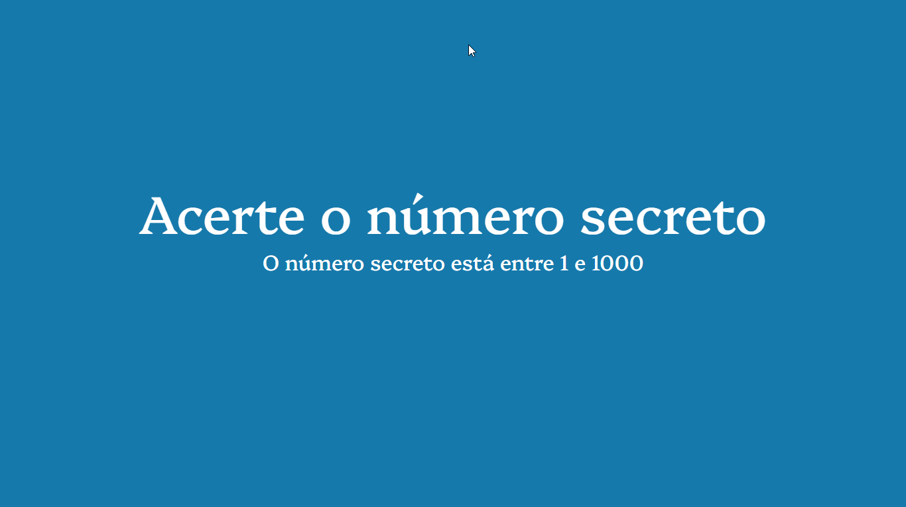

<h1>Descrição do projeto</h1>

"Este projeto consiste em um jogo simples de adivinhação, onde o usuário tenta adivinhar um número secreto escolhido aleatoriamente pelo sistema. O sistema fornece feedback ao usuário, indicando se o palpite foi maior, menor ou igual ao número secreto. O jogo termina quando o usuário acerta o número secreto.
Projeto desenvolvido no curso da Alura. "

### 🛠 Tecnologias

As seguintes ferramentas foram usadas na construção do projeto:

- [JavaScript](https://www.javascript.com/)

<h4 align="center"> 
	🚀 Finalizado...
</h4>